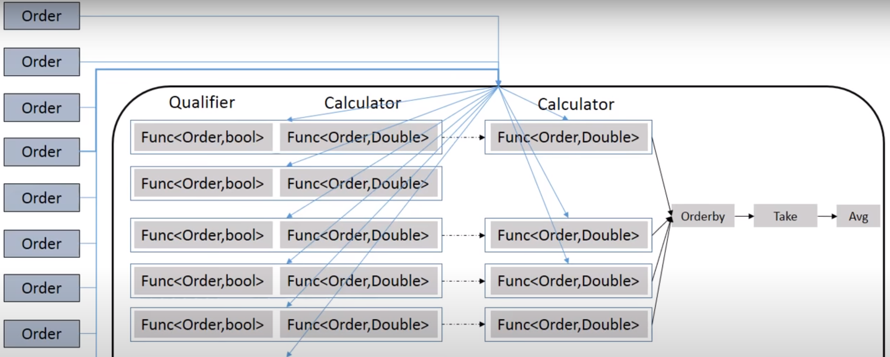

# Retail Store ETL Rule Engine Project

## Overview
This ETL (Extract, Transform, Load) project aims to develop a rule engine for a retail store to qualify orders' transactions for discounts based on a set of predefined rules. The discounts are automatically calculated according to specific criteria such as product expiration, product type, special promotions, and quantity purchased. The project emphasizes functional programming principles and clean, maintainable code.

## Project Code
The project's source code can be found [here](https://github.com/MarkSamuell/Retail-Rule-Engine-with-Scala/tree/master/src/main/scala).

### RuleEngine.scala:

This Scala script defines a rule engine responsible for calculating discounts for retail store orders based on predefined rules. Here's a brief overview of what it does:

Order Definition: Defines a case class Order representing an order with various attributes such as timestamp, product name, expiry date, quantity, unit price, channel, payment method, discount, and final price.
Parsing Orders: Reads lines from a CSV file containing order data, parses each line and converts it into an Order object.
Discount Calculation: Defines several discount rules (A, B, C, D, E) along with their corresponding qualification functions and calculation functions.
Rule Application: Defines a function to apply a list of discount rules to each order, calculate the discounts, and update the order with the discount and final price.
Database Writing: Utilizes a DbWriter object to write the orders with calculated discounts to an Oracle database.
Logging: Logs events such as successful database connection, insertion, or encountered errors using a custom logEvent method.

### Rules.scala:

This Scala script defines the discount qualification and calculation rules used by the rule engine. Here's a brief overview of what it does:

Rule Definitions: Defines several discount rules (A, B, C, D, E) along with their corresponding qualification functions and calculation functions.
Rule A: Qualifies orders based on the proximity of the expiry date to the order timestamp and calculates the discount accordingly.
Rule B: Qualifies orders based on the product name (starting with "Wine" or "Cheese") and calculates the discount accordingly.
Rule C: Qualifies orders based on specific dates (23rd of March) and applies a fixed discount.
Rule D: Qualifies orders made through a specific channel ("App") and calculates the discount based on the quantity purchased.
Rule E: Qualifies orders based on the payment method ("Visa") and applies a fixed discount.

### DbWriter.scala:

This Scala script defines a database writer module responsible for writing order data with calculated discounts to an Oracle database. Here's a brief overview of what it does:

Database Connection: Connects to an Oracle database using JDBC, with a specified URL, username, and password.
Insert Statement: Prepares an SQL INSERT statement to insert order data into the database.
Batch Insertion: Utilizes JDBC batch processing to efficiently insert multiple orders into the database in a single batch operation.
Logging: Provides logging functionality to record events such as successful database connection, insertion, or any encountered errors. Log messages include timestamps, log types (Debug, Info, Error), and corresponding messages.
Writing Orders: The write method takes a list of order objects (Order) as input and inserts them into the database using the prepared INSERT statement.
Exception Handling: Catches any exceptions that may occur during database operations and logs corresponding error messages.

## Problem Statement
The retail store requires a rule engine to automate the qualification of discounts for order transactions. The discounts are determined based on several qualifying rules and calculation rules, including product expiration, product type, special promotions, and quantity purchased. Transactions that qualify for multiple discounts receive the top two discounts, and their average is applied.

## Milestones
1. **Rule Definition:** Define the qualifying rules and calculation rules for discounts.
2. **Data Extraction:** Extract transaction data from the source system.
3. **Data Transformation:** Apply discount qualification and calculation logic to the extracted data.
4. **Data Loading:** Load the transformed data, including final prices, into a database table.
5. **Logging Implementation:** Set up logging functionality to record engine events.

## Technical Considerations
- **Core Functional Logic:** The core logic of the rule engine must adhere to functional programming principles, utilizing only `vals` with no `vars`, avoiding mutable data structures and loops, and ensuring all functions are pure with no side effects.
- **Logging:** Engine events are logged in a "rules_engine.log" file with timestamp, log level, and message format.
- **Data Persistence:** After discount calculations, the final price is computed and loaded into a database table.
- **Code Quality:** The codebase must be well-commented, clean, easy to read, and self-explanatory, emphasizing readability and maintainability.

## Usage
To use the ETL rule engine:
1. Define the rules for discount qualification and calculation.
2. Extract transaction data from the source system.
3. Transform the extracted data by applying discount qualification and calculation logic.
4. Load the transformed data, including final prices, into a database table.
5. Monitor engine events and log messages in the "rules_engine.log" file for debugging and analysis.
